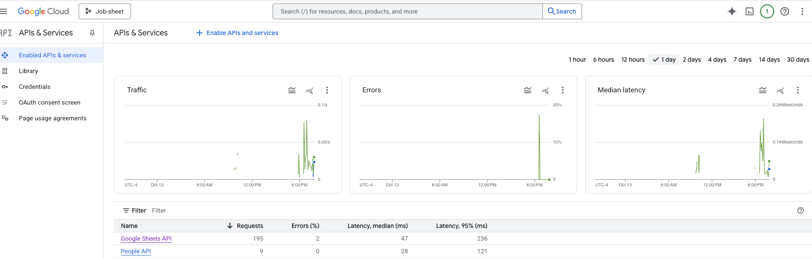
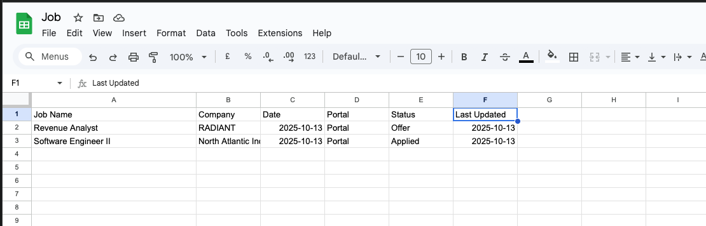

# Job Application Tracker

A **dynamic, single-page web application** to efficiently track and manage your job applications, powered by Google Sheets as a backend database. Get a modern interface, full CRUD, and insightful analytics for your job search—all for free.

---

---

---

---
## 🚀 Features

- **Google Sheets Backend:** Use a live, free, and easy-to-manage Google Sheet as your database.
- **Google Authentication:** Securely sign in with your Google account; your data remains private.
- **Personalized Experience:** Displays your Google profile name and avatar.
- **CRUD Functionality:**
  - **Create:** Add new job applications using an intuitive form.
  - **Read:** See all your applications in a clean, card-based layout.
  - **Update:** Instantly change the status of applications.
  - **Delete:** Remove any applications as needed.
- **Live Search & Filter:** Instantly search/filter by job title, company, or portal.
- **Rich Data Visualizations:**
  - **Statistics Blocks:** Quick summaries of application status (Applied, Interviewed, Offer, Rejected).
  - **Portal Pie Chart:** See which job platforms/portals you use most.
  - **Interactive Timeline:** Visualize activity and trends over time, with flexible filtering.

---

## 🛠 Tech Stack

- **Frontend:** HTML5, Tailwind CSS, Vanilla JavaScript
- **Backend:** Google Sheets (via Google Sheets API v4)
- **Authentication:** Google Identity Services (GSI) for Web
- **Data Visualization:** Chart.js

---

## 📝 Setup Instructions

1. **Prepare Your Google Sheet:**
    - Create a new sheet.
    - Add these headers in the first row and order:
        - `A1: Job Name`
        - `B1: Company`
        - `C1: Date`
        - `D1: Portal`
        - `E1: Status`
        - `F1: Last Updated`
    - Share your sheet: Click `Share` > change "Restricted" to "**Anyone with the link**".
    - Copy your Spreadsheet ID (visible in the sheet’s URL).

2. **Configure Google Cloud:**
    - Go to [Google Cloud Console](https://console.cloud.google.com/), create a new project.
    - Enable **Google Sheets API** and **Google People API**.
    - Go to `APIs & Services > Credentials`:
        - **Create API Key** (save this key).
        - **Create OAuth 2.0 Client ID:**
            - Application type: Web application.
            - Authorized origins:
                - `http://localhost`
                - `http://127.0.0.1:5500`
                - `https://your-github-username.github.io`
            - Save your Client ID.
        - On `OAuth consent screen` tab, set Publishing Status to "Testing", add your email as a test user.

3. **Configure the App:**
    - In your project’s `index.html`, find the "USER CONFIGURATION SECTION".
    - Paste in the `CLIENT_ID`, `API_KEY`, and `SPREADSHEET_ID`.

4. **Deploy (Optional):**
    - Push your files to a GitHub repository.
    - In repo settings, enable GitHub Pages from the `main` branch.
    - Access your deployed app at: `https://your-github-username.github.io/your-repo-name/`

---

## 📄 License

This project is licensed under the **MIT License**.

---

*Happy job hunting!*

================================================================================
                               JOB APPLICATION TRACKER
================================================================================

[ DESCRIPTION ]
A dynamic, single-page web application designed to efficiently track and manage 
job applications. It uses Google Sheets as a backend database, offering a modern 
interface, full CRUD capabilities, and insightful analytics for your job search 
journey.

[ FEATURES ]
- Google Sheets Backend: Uses a live Google Sheet as a free database.
- Google Authentication: Secure sign-in using your Google account.
- Dashboard & Stats: 
  - Visual summary of applications (Applied, Interviewed, Offers, Rejected).
  - Portal distribution charts (e.g., LinkedIn, Indeed).
  - Application timeline graph.
- Management Views:
  - List View: Standard table-like rows.
  - Kanban Board: Drag-and-drop interface to change application status.
- CRUD Operations: Add, Read, Update, and Delete applications easily.
- Search & Filter: Real-time filtering by company, status, or job title.
- Export Data: Export your tracking data to CSV or XLSX formats.
- Dark Mode: Built-in theme toggle.

[ TECH STACK ]
- Frontend: HTML5, Tailwind CSS, Vanilla JavaScript
- Backend/DB: Google Sheets (via Google Sheets API v4)
- Auth: Google Identity Services (GSI)
- Libraries: Chart.js (Visualization), SheetJS (Export)

================================================================================
                               SETUP INSTRUCTIONS
================================================================================

1. PREPARE GOOGLE SHEET
   - Create a new Google Sheet.
   - In the first row, add the following headers in this exact order:
     A1: Job Name
     B1: Company
     C1: Date
     D1: Portal
     E1: Status
     F1: Last Updated
   - Share the sheet: Set permissions to "Anyone with the link" (or restricted to 
     specific users if you handle auth scopes strictly).
   - Copy the Spreadsheet ID from the URL (between /d/ and /edit).

2. CONFIGURE GOOGLE CLOUD CONSOLE
   - Go to https://console.cloud.google.com/ and create a project.
   - Enable the following APIs:
     - Google Sheets API
     - Google People API
   - Create Credentials:
     - API Key: Restrict this to the domains you plan to use if deploying.
     - OAuth 2.0 Client ID: Set "Authorized Javascript Origins" to your local 
       server (e.g., http://localhost:5500) or your production URL.

3. CONFIGURE THE APPLICATION
   - Open the file `config.js` in the project root.
   - Update the constants with your credentials:
     const CLIENT_ID = 'YOUR_GOOGLE_CLIENT_ID';
     const API_KEY = 'YOUR_GOOGLE_API_KEY';
     const SPREADSHEET_ID = 'YOUR_SPREADSHEET_ID';

4. RUNNING THE APP
   - Since this uses Google Auth, it must be run on a server (it will not work 
     if opened directly as a file://).
   - Use a local server like Live Server (VS Code extension) or Python:
     python3 -m http.server 8000
   - Navigate to http://localhost:8000 in your browser.

================================================================================
                               LICENSE
================================================================================
MIT License

Copyright (c) 2025 HARSHAL SANJIV PATIL

Permission is hereby granted, free of charge, to any person obtaining a copy
of this software and associated documentation files (the "Software"), to deal
in the Software without restriction, including without limitation the rights
to use, copy, modify, merge, publish, distribute, sublicense, and/or sell
copies of the Software, and to permit persons to whom the Software is
furnished to do so, subject to the following conditions:

The above copyright notice and this permission notice shall be included in all
copies or substantial portions of the Software.

THE SOFTWARE IS PROVIDED "AS IS", WITHOUT WARRANTY OF ANY KIND, EXPRESS OR
IMPLIED, INCLUDING BUT NOT LIMITED TO THE WARRANTIES OF MERCHANTABILITY,
FITNESS FOR A PARTICULAR PURPOSE AND NONINFRINGEMENT. IN NO EVENT SHALL THE
AUTHORS OR COPYRIGHT HOLDERS BE LIABLE FOR ANY CLAIM, DAMAGES OR OTHER
LIABILITY, WHETHER IN AN ACTION OF CONTRACT, TORT OR OTHERWISE, ARISING FROM,
OUT OF OR IN CONNECTION WITH THE SOFTWARE OR THE USE OR OTHER DEALINGS IN THE
SOFTWARE.
