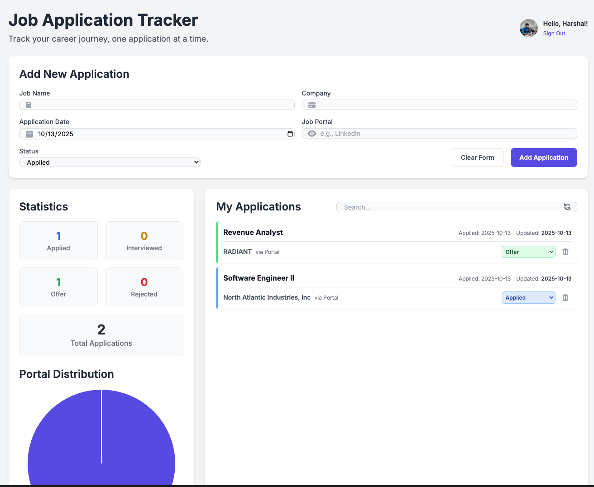

# Job Application Tracker

A **dynamic, single-page web application** to efficiently track and manage your job applications, powered by Google Sheets as a backend database. Get a modern interface, full CRUD, and insightful analytics for your job search—all for free.

---

---

## 🚀 Features

- **Google Sheets Backend:** Use a live, free, and easy-to-manage Google Sheet as your database.
- **Google Authentication:** Securely sign in with your Google account; your data remains private.
- **Personalized Experience:** Displays your Google profile name and avatar.
- **CRUD Functionality:**
  - **Create:** Add new job applications using an intuitive form.
  - **Read:** See all your applications in a clean, card-based layout.
  - **Update:** Instantly change the status of applications.
  - **Delete:** Remove any applications as needed.
- **Live Search & Filter:** Instantly search/filter by job title, company, or portal.
- **Rich Data Visualizations:**
  - **Statistics Blocks:** Quick summaries of application status (Applied, Interviewed, Offer, Rejected).
  - **Portal Pie Chart:** See which job platforms/portals you use most.
  - **Interactive Timeline:** Visualize activity and trends over time, with flexible filtering.

---

## 🛠 Tech Stack

- **Frontend:** HTML5, Tailwind CSS, Vanilla JavaScript
- **Backend:** Google Sheets (via Google Sheets API v4)
- **Authentication:** Google Identity Services (GSI) for Web
- **Data Visualization:** Chart.js

---

## 📝 Setup Instructions

1. **Prepare Your Google Sheet:**
    - Create a new sheet.
    - Add these headers in the first row and order:
        - `A1: Job Name`
        - `B1: Company`
        - `C1: Date`
        - `D1: Portal`
        - `E1: Status`
        - `F1: Last Updated`
    - Share your sheet: Click `Share` > change "Restricted" to "**Anyone with the link**".
    - Copy your Spreadsheet ID (visible in the sheet’s URL).

2. **Configure Google Cloud:**
    - Go to [Google Cloud Console](https://console.cloud.google.com/), create a new project.
    - Enable **Google Sheets API** and **Google People API**.
    - Go to `APIs & Services > Credentials`:
        - **Create API Key** (save this key).
        - **Create OAuth 2.0 Client ID:**
            - Application type: Web application.
            - Authorized origins:
                - `http://localhost`
                - `http://127.0.0.1:5500`
                - `https://your-github-username.github.io`
            - Save your Client ID.
        - On `OAuth consent screen` tab, set Publishing Status to "Testing", add your email as a test user.

3. **Configure the App:**
    - In your project’s `index.html`, find the "USER CONFIGURATION SECTION".
    - Paste in the `CLIENT_ID`, `API_KEY`, and `SPREADSHEET_ID`.

4. **Deploy (Optional):**
    - Push your files to a GitHub repository.
    - In repo settings, enable GitHub Pages from the `main` branch.
    - Access your deployed app at: `https://your-github-username.github.io/your-repo-name/`

---

## 📄 License

This project is licensed under the **MIT License**.

---

*Happy job hunting!*
